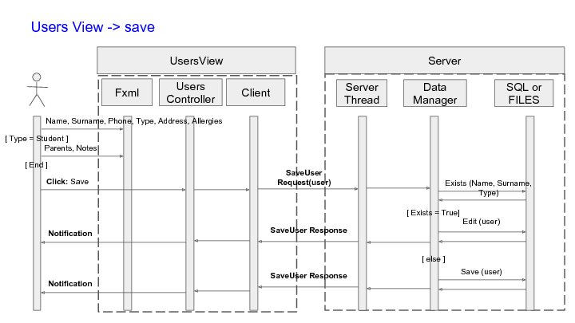
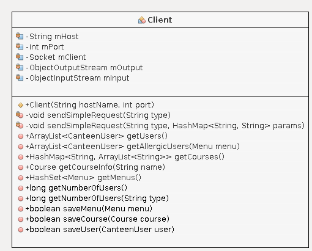
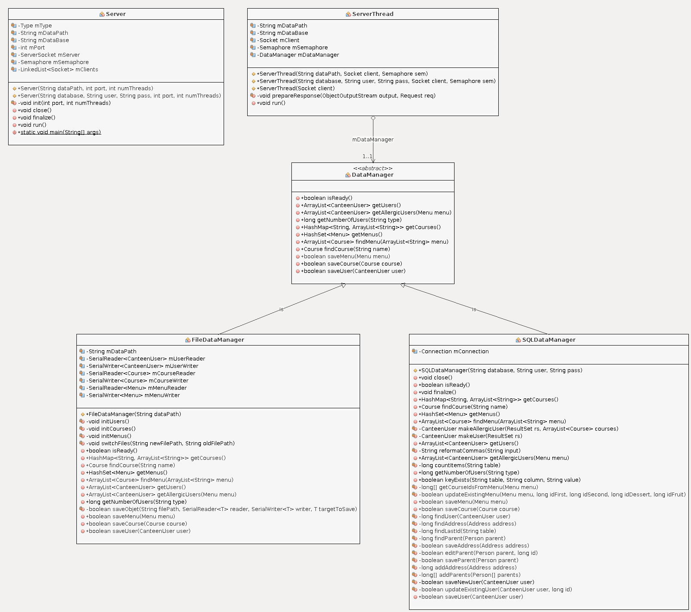

## Meals and Allergies

The aim of this excercise is to make a software to manage a univerity canteen. The user must be able to set a menu (first, second, dessert or fruit courses) and save it. He/she should be notified of the number of cateen users that are allergic to some of the ingredients of a course, and which course it they are allergic to (first, second or third). There are a client and a server. 

**Find a demo of this readme on [youtube](https://youtu.be/GtadlQy4dOU).**

#### Enviroment 

I use Linux (Ubuntu). The project was designed in NetBeans and run/debugged from there. The folder struture allows you to run the project in the same way if you use NetBeans.

#### Build the project

In Netbeans load and build these ones with `F11`, in this order:

1. common (library)
2. server (app, with library *common.jar* attached in build.xml)
3. client (library, depends on *common.jar*)
4. gui (app, depends on *client.jar*)

#### Build the data

You can do it in two ways, depending on the **server** using **SQLDataManager** or **FileDataManager** to retrieve the data. 

##### 1. MySQL and JDBC Connector

Install MySQL if you haven't yet. You can do it directly from the command line.

    sudo apt-get install mysql-server -y 

MySQL Connector library is installed locally in the project, and contained in the folder **libs**.

Run the queries in database dump to create the database schema *meals_and_allergies* and insert the test data (100 users, 31 courses, 2 menu planned). 

    mysql --user root --password < sql/data_setup.sql

*Optional*. Install a GUI to use it. I used MySQL Workbench. [Download](https://cdn.mysql.com//Downloads/MySQLGUITools/mysql-workbench-community-6.3.10-1ubuntu16.04-amd64.deb)

    sudo dpkg -i mysql-workbench-community-6.3.10-1ubuntu16.04-amd64.deb
    sudo apt-get -f install
    
*Optional*. Install *your own library* MySQL Connector for Java. [Download](https://cdn.mysql.com//Downloads/Connector-J/mysql-connector-java_8.0.11-1ubuntu16.04_all.deb)

    sudo dpkg -i mysql-connector-java_8.0.11-1ubuntu16.04_all.deb
    sudo apt-get -f install 
    sudo apt autoremove #may be required

*Clean up at the end of the demo*. You can remove the user and database created with 

    mysql --user root --password
    Enter password: 
    mysql> drop database meals_and_allergies;
    mysql> drop user "10429624"@"localhost";
    mysql> quit;
    

The library has been added to the *server* project from netbeans, so it should already be in the build.xml. If not, add it as`Projects-> server -> Properties -> Libraries -> Add Library : MySQL JDBC Driver`. 

##### 2. Flat file system

Flat files (newlines) are platform dependent. To avoid this problem data are automatically generated on your side with the  **common.io.DataGenerator** class. If there isn't already one in the main directory, create a folder called **data**, and execute this. 

	java -jar common/dist/common.jar /path/to/data

#### TEST with JUNIT

Unit **tests are per module**. If you want to run them, load the module (common, client, or server) in NetBeans, right click `Test` or `Alt+F6` on the module name. 

They use JUNIT, which library is installed locally from the folder **libs**.

*Note*: the tests of the module **server** necessitate data to have been generated (the above paragraphs, points (1) and (2)).

#### Run the server

The server needs to know where the data is stored and what port of the (localhost) to server to. You can choose the type of server you want to use (database or  file system) when you launch it.

##### (a) using MySQL and JDBC Connector

I used port-number 8080, database "meals_and_allergies", user "10429624", pass "angelo".

	java -jar server/dist/server.jar port-number database-name user passwd

##### (b) Using a flat file system

I used port-number 8080.

	java -jar server/dist/server.jar port-number /path/to/data

#### Run the GUI

This is your own interface. *localhost* and *8080* are hardcoded in the software. 

    java -jar gui/dist/gui.jar

It will give you the following options to view/save menus, view allergic users, view / add courses, view / add / edit users to the database. 

#### UML

A **sequence diagram** was created manually, and added in **uml** folder as a pdf. 

A **class diagram** is available in the same folder. It was created with the easyUML plugin of netbeans. `Projects -> New Project -> UML` called *uml*. `uml -> New folder` called *server*. `Projects -> Server -> server -> easyUML create class diagram -> uml/server`. 

##### sequence diagram : Menu View

##### sequence diagram : Course View

##### sequence diagram : MenuPlan View

##### sequence diagram : Users View

##### class diagram : common library 

Canteen

Comm

Io

University

##### class diagram : client

##### class diagram : server

##### class diagram: gui

